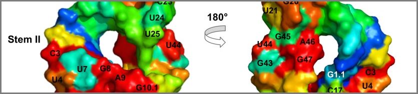
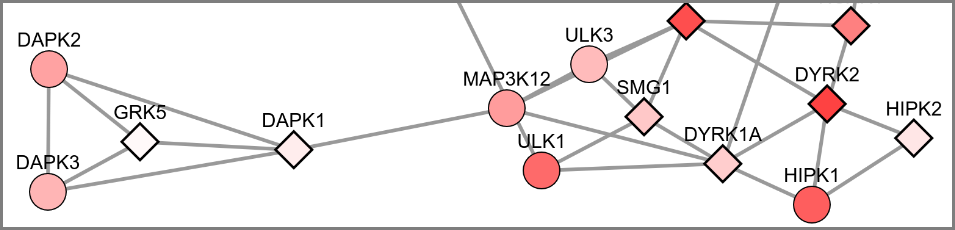
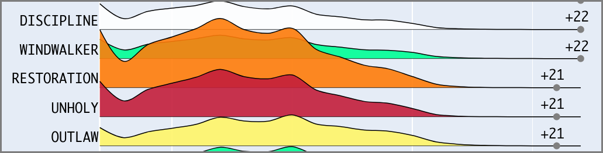

Hello,

My name is Ilya (eel-ya) Novikov, and this is my home page. For now, the primary purpose of this
page is to provide evidence of my prior work. 

For a sample of my most impactful projects please see below. Additionally, see the [Skills](/skills/)
section for a nitty-gritty overview of the tools can I use, and the [About](/about/) section for a quick
overview of my history.

# Examples of Work
---
- [Ranking nucleotides in RNA by comparative sequence analysis](#anchor1)
- [Predicting novel protein functions by graph learning on GO similarity networks](#anchor2)
- [Analysis of Blizzard API data reveals patterns of player behavior](#anchor3) 

---

#### Ranking nucleotides in RNA by comparative sequence analysis 

In all living cells there are molecules called Ribonucleic Acids (RNAs). Most of the them are
inert templates that carry information from DNA to proteins as messenger RNA (see [Central Dogma](https://en.wikipedia.org/wiki/Central_dogma_of_molecular_biology)).
Some RNAs, however, are actively functional - just like proteins, they are catalytic and
do useful work within the cell. I helped develop a method, the RNA Evolutionary Trace,
that scans the evolutionary history of these molecules and predicts their most important
nucleotides. Ranking nucleotides by their importance allows wet-lab researches to narrow
their efforts when studying these molecules.

The key deliverable of this project was the extensive computational 
validation I did to prove that the method works as advertised, published in PLOS One.

[github](https://github.com/ily123/rna_et){: .btn .btn--primary .btn--large}
[publication](https://pubmed.ncbi.nlm.nih.gov/32208421/){: .btn .btn--primary .btn--large}

----
#### Predicting novel protein functions by graph learning on GO similarity networks 

Proteins don't work in isolation. They work together and form networks.
In practice, this means that once you've identified a protein associated with some 
critical process, you can query that protein's network to find additional proteins 
that are involved in the same process. In case of disease, this allows you to expand
the candidate list of theraupeutic targets, and arrive at a cure faster.

I developed a new approach for constructing protein networks using data from the [Gene Ontology](http://geneontology.org/)
database. Gene Ontology classifies proteins with functional labels, and these labels
can be used to calcualte similarity between any pair of proteins. The similarity scores
can be then be converted into a graph/network where most similar proteins are connected
by edges. Finally, the graph itself can then be used to find clusters of related
proteins using community detection or information diffusion.

The main deliverable of this project was the presentation at the 
International Society for Computational Biology in Prague (2017), and the web app tool
linked below. Using the tool, you can diffuse labels across a GO similarity 
network of human kinases.

[webapp](https://ggid.herokuapp.com/){: .btn .btn--success .btn--large}
[github](https://github.com/ily123/ggid){: .btn .btn--primary .btn--large}
[thesis chapter](https://github.com/ily123/thesis){: .btn .btn--primary .btn--large}

Heroku dyno that runs the app goes to sleep after 30 minutes of inactivity. So it will 
take 20-30 seconds for the page to respond while the dyno wakes up.

----
#### Analysis of Blizzard API data reveals patterns of player behavior 

Blizzard, the operator of the _World of Warcraft_ MMO,
provides troves of data on their player behavior. I was curious to see if I can find any
interesting patterns in that behavior. So I wrote a pipeline that continuously scans Blizzard's API for data,
stores it in the cloud, and displays the results as [this interactive dashboard](https://www.benched.me/).

The dashboard allows players to see how representation of different
character archetypes changes with time and level of competition. This enables players
to adjust their own in-game choices to be more competitive. The dashboard 
is visited by 15,000 unique visitors monthly, and has been well recieved by the community.
WoWHead, the game's largest news site, did a series of articles using the dashboard as well ([**1**](https://www.wowhead.com/news=318824/shadowlands-tank-mythic-popularity-for-pre-patch-on-benched-me), [**2**](https://www.wowhead.com/news=318842.3/shadowlands-healer-mythic-popularity-for-pre-patch-on-benched-me), [**3**](https://www.wowhead.com/news=318851.2/shadowlands-dps-mythic-popularity-for-pre-patch-on-benched-me)).

The fun/instructive part of this project was dealing with large amounts of data
(~150 million rows and growing), as well as building infrastructure that runs without human supervision.
This project taught me RDBMS/SQL + the basics of deploying on AWS.

[webapp](https://www.benched.me/){: .btn .btn--success .btn--large}
[github backend](https://github.com/ily123/metawatch){: .btn .btn--primary .btn--large}
[github frontend](https://github.com/ily123/metawatch-dash){: .btn .btn--primary .btn--large}
[reddit blog](https://www.reddit.com/user/OtherwiseUniversity7/posts/){: .btn .btn--primary .btn--large}

